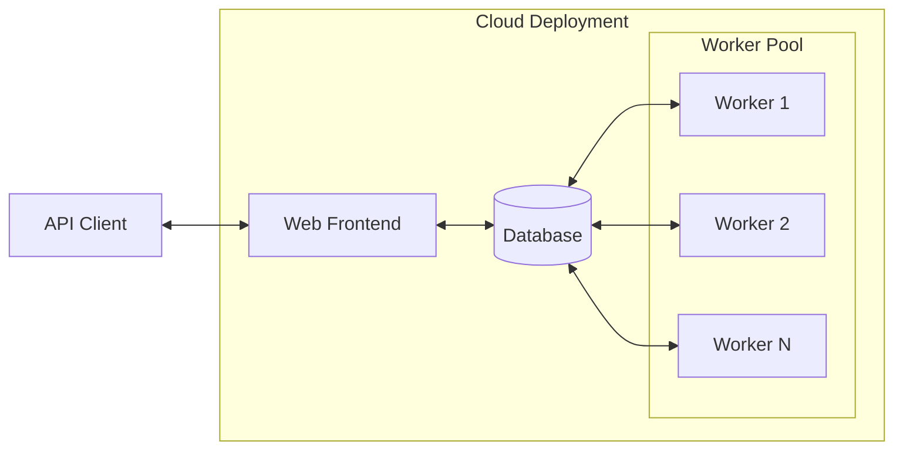

# BOPTEST-Service

This software reformulates [BOPTEST](https://github.com/ibpsa/project1-boptest) into a web based software as a service, which enables BOPTEST to support multiple clients and multiple simultaneous tests at a large scale. This is a containerized architecture that can be deployed on a personal computer, however the software is targetd at commercial cloud computing environments such as AWS. For details about BOPTEST, refer to the project [homepage](https://boptest.net).

The canonical BOPTEST source code is incorporated into this repository as a git subtree located at `<project-root>/boptest` and used under the terms of the license located at `<project-root>/boptest/license.md`. 

# Getting Started

A demonstration of using the BOPTEST API is available in the form of a short [interactive tutorial](https://github.com/NREL/boptest-service/blob/documentation_readme_changes/docs/Introduction_to_BOPTEST_Service_APIs.ipynb). This tutorial leverages a publicaly available deployment of `boptest-service` which can be reached at https://api.boptest.net.

A more in depth tutorial has been developed to support a number of BOPTEST workshops and is available [here](https://github.com/NREL/boptest-service/blob/develop/boptest/docs/workshops/BS21Workshop_20210831/Introduction_to_the_BOPTEST_framework.ipynb).

# OpenAI Gym Interface

An [OpenAI-Gym](https://github.com/openai/gym) environment for BOPTEST is [availble](https://github.com/ibpsa/project1-boptest-gym), including an [interfactive tutorial](https://github.com/ibpsa/project1-boptest-gym/blob/master/docs/tutorials/CCAI%20Summer%20School%202022/Tutorial_2_Building_Control_with_RL_using_BOPTEST.ipynb).

# BOPTEST-Service APIs

The core BOPTEST APIs are [documented](https://github.com/ibpsa/project1-boptest#test-case-restful-api) as part of the upstream BOPTEST project. The BOPTEST-Service defines a number of APIs on top of BOPTEST for the purpose of managing test cases and running tests.

| Interaction                                                                                                                     | Request                                   |
|---------------------------------------------------------------------------------------------------------------------------------|-------------------------------------------
| List available test cases.                                                                                                      | GET `testcases`                           |
| Check if specific test case is in list of available test cases. Returns status code of `200` (OK) if found, `404` if not found. | GET `testcases/{testcase_name}`           |
| Select a test case and begin a new test. A unique ``testid`` will be returned.                                                  | POST ``testcases/{testcase_name}/select`` |
| Stop a running test.                                                                                                            | PUT ``stop/{testid}``                     |

# Building and Running on a Personal Computer
1) Clone this repository.

 * ``git clone https://github.com/NREL/boptest-service.git`` 
  
2) Install [Docker](https://docs.docker.com/get-docker/).

3) Use Docker to build and run BOPTEST-Service.

  * ``docker compose up web worker provision``

4) In a separate process, use the core [BOPTEST APIs](https://github.com/ibpsa/project1-boptest/tree/boptest-service#test-case-restful-api) as well as [BOPTEST-service APIs](https://github.com/NREL/boptest-service/tree/documentation_readme_changes#boptest-service-specific-apis) to interact with the test case using your test controller.  

5) Shutdown the test case by the command ``docker compose down`` executed in the root directory of this repository.

# Kubernetes Based Deployment

NREL maintains a helm chart for Kubernetes based deployments of BOPTEST-Service.

# Running the developer Test Suite

Testing is based on the BOPTEST [test suite](https://github.com/NREL/boptest-service/tree/develop/boptest/testing) with small adaptations to conform to the BOPTEST-Service API. Follow the [README](https://github.com/NREL/boptest-service/blob/develop/boptest/testing/README.md) for more information.
